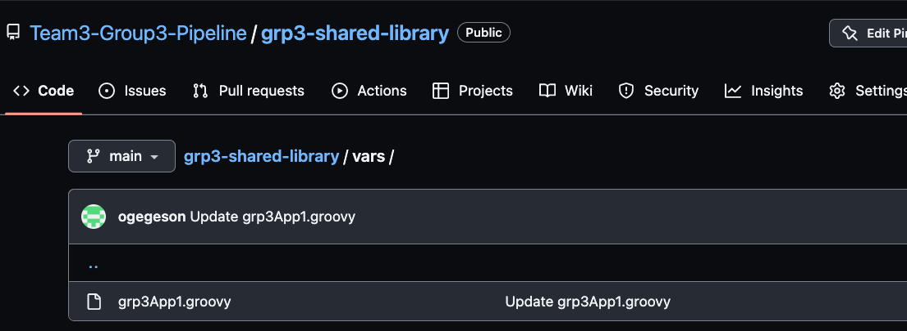
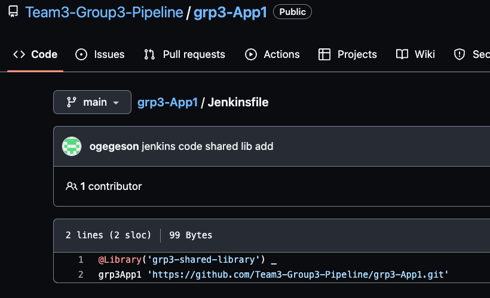
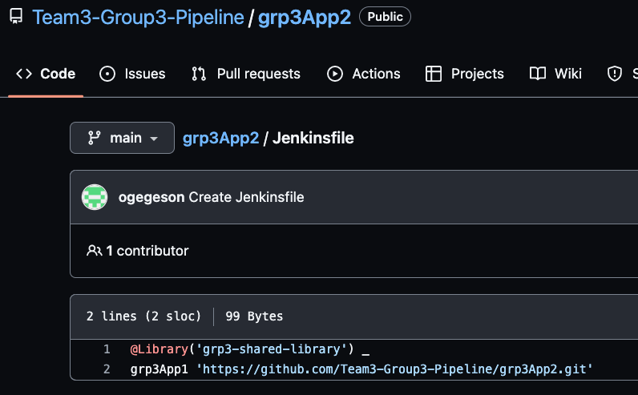
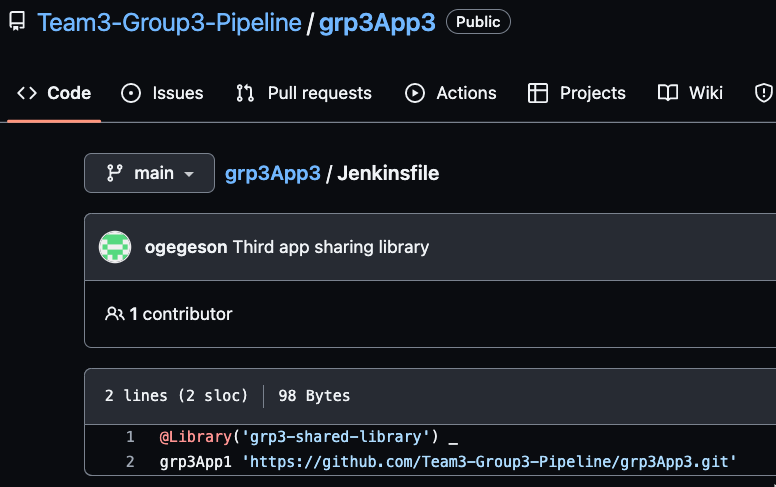

# Jenkins Shared Library

**Project Description**

The objective is to build and deploy three applications utilizing Jenkins Shared Library. The three applications to be deployed have a similar build process therefore, they all use the same groovy file on their individual jenkins file which points their deployment process to the shared library called grp3App1.groovy.

Jenkins shared library is a collection of Groovy scripts shared between different Jenkins jobs. At runtime, this script is pulled into each application's Jenkinsfile. As a result, the developers avoid writing the same code from scratch for multiple projects. This drastically cuts down the time spend on coding and avoids duplicate codes.

**How Jenkins Shared Library is Configured**

1) Create a Groovy script using the code we want to save in the library. This script needs to be saved in a /vars folder within the shared library Github project repository (grp3-shared-library/vars/grp3App1.groovy). 
2) Add a Shared Library in Jenkins. This is accomplished by the following steps:
   * Jenskins dashboard -> Manage Jenkins -> Configure Systems (System Configurations section) -> click "Add" (Global Pipeline Libraries section) - > Fill library details (Name, Default version such as branch name, Load Implicitly, etc.) -> Save
3) Use the Shared Library in Jenkins pipeline of the various applications
   * Create a new Jenkins pipeline for each project and also create Github projects for each application. Make sure to configure the Jenkins pipelines to each of the Github project repositories by selecting the necessary Git option from SCM drop down menu, add repository URL, add credentias, and "main branch". 

     Call the shared library groovy script in each of the projects' Jenkinsfile as follows:

     
   * 

     

Challenges: Remember to caMel case the application names within each Jenskinsfile so that Jenkins pipeline can perform the build process.

Credits: Thank you Engr. Elvis & Engr. Rudolph for sharing their knowledge!!!
